# Stroke Prediction Project

This project predicts stroke events using 11 clinical features. The dataset is sourced from Kaggle, and the application is deployed using AWS services and Streamlit.

# deployed url : 
The deployed application is available at:
https://project-cloud-computing-25201460-kartikeya-sharma.streamlit.app/

## Steps to Set Up the Project

### 1. Download the Dataset
Download the stroke prediction dataset from Kaggle:  
[Stroke Prediction Dataset](https://www.kaggle.com/datasets/fedesoriano/stroke-prediction-dataset/data)  

The dataset contains 11 clinical features for predicting stroke events. Save the file as `stroke.csv` in the project directory.

### 2. Set Up AWS S3
- Follow the screenshots below to set up an S3 bucket:
  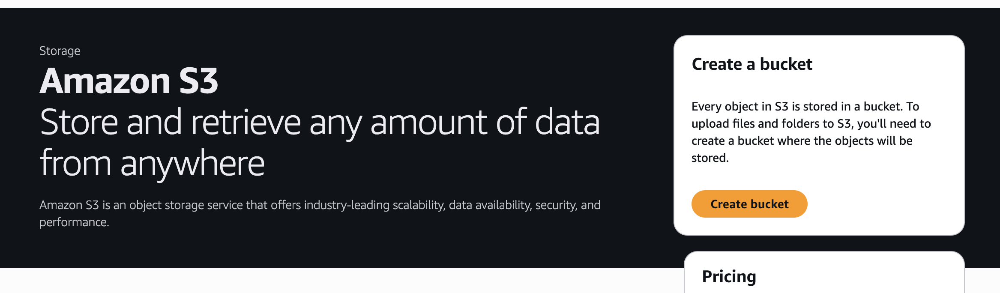  
  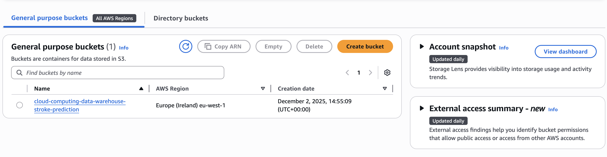  
- Upload the `stroke.csv` file to the S3 bucket.

### 3. Set Up AWS Glue Crawler
- Use AWS Glue to create a crawler for the dataset.
- Refer to the screenshots below for step-by-step guidance:  
  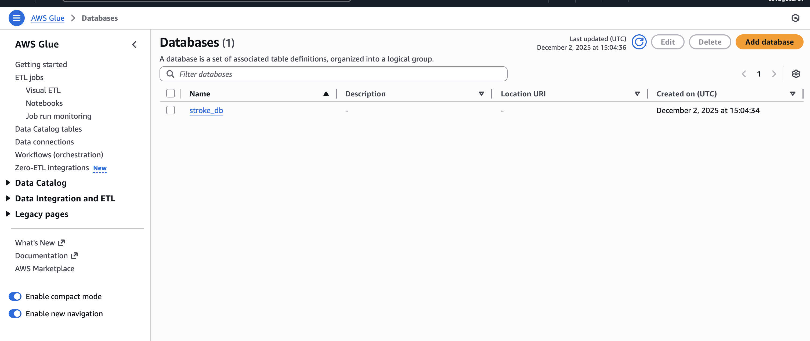  
  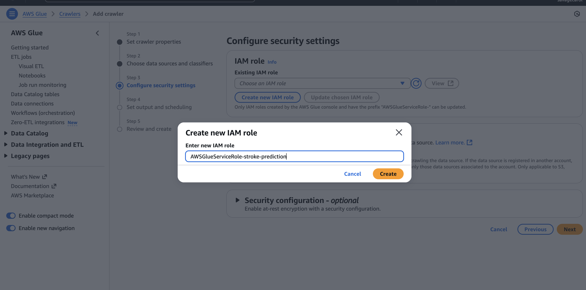  
  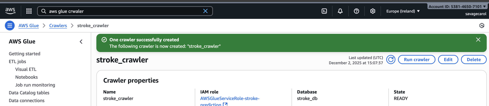  
  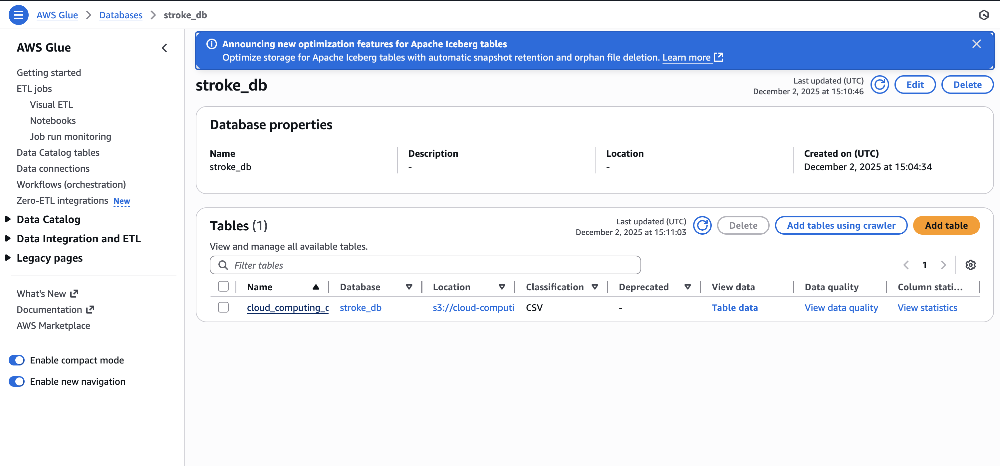  

### 4. Add Athena to AWS
- Configure AWS Athena to query the data.
- Follow the screenshots below for detailed instructions:  
  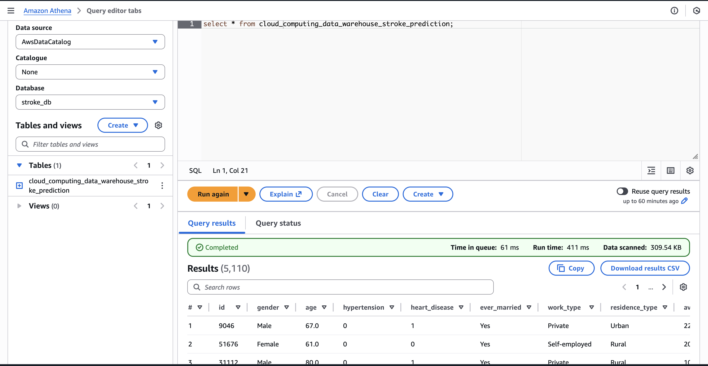  
  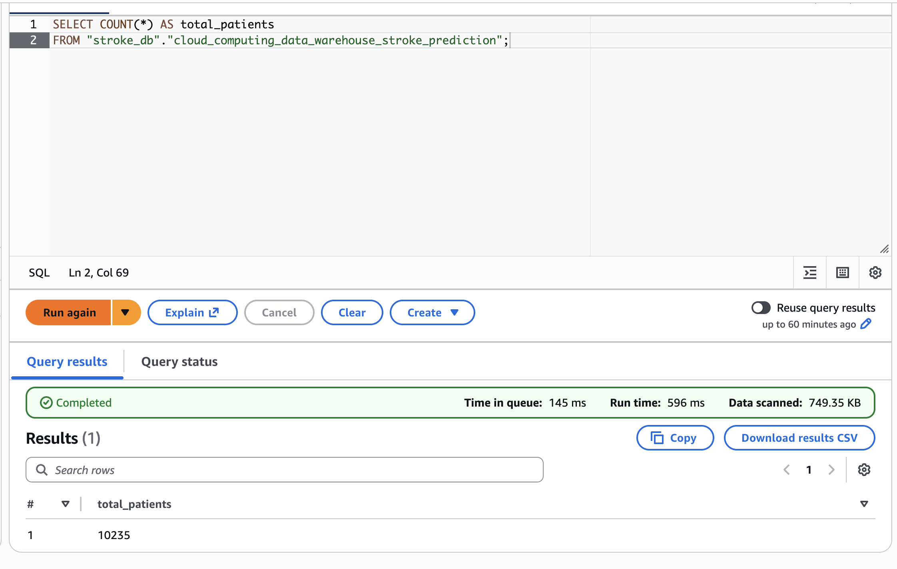  
  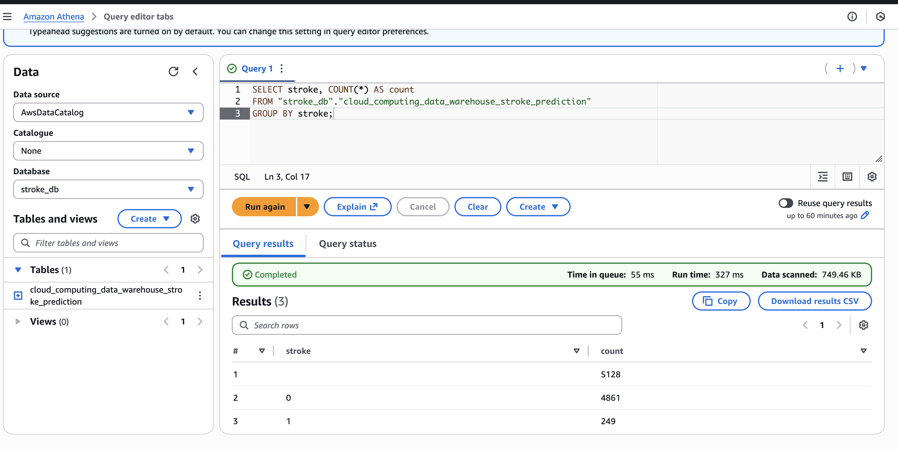  
  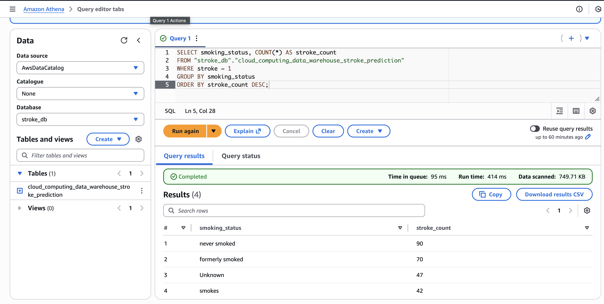  
  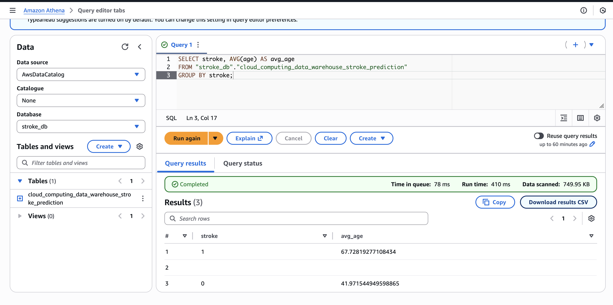  
    

### 5. Create User and Access Policy
- Create an AWS user with the necessary access policies for S3, Glue, and Athena.
- Generate an access key for the user.

### 6. Code Explanation
The project uses Python and Streamlit for building the application. The main code is in `main.py`, which:
- Reads data from AWS Athena.
- Generates dynamic graphs based on user queries.
- Displays the results using Streamlit.

### 7. Streamlit Application
- The Streamlit app provides an interactive interface for querying and visualizing the data.
- Refer to the screenshots below to see the app in action:  
    
  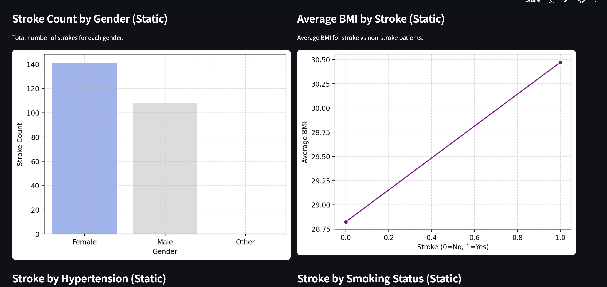  
    
  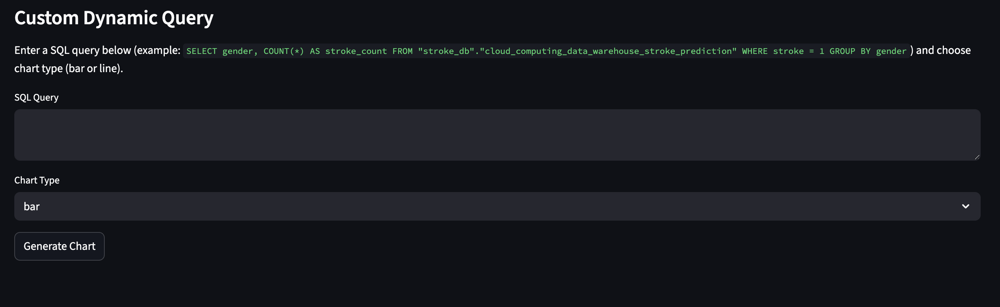  

### 8. Running the Project Locally
- Complete all the setup steps mentioned above.
- Add your AWS credentials to `.streamlit/secrets.toml` as follows:
  ```toml
  [aws]
  aws_access_key_id = "your_access_key_id"
  aws_secret_access_key = "your_secret_access_key"
  Run the Streamlit app locally: 
    streamlit run main.py

### 9. Dynamic Graph Generator
The Streamlit app allows users to write custom queries to generate dynamic graphs. The app connects to Athena to fetch the queried data and visualizes it.

